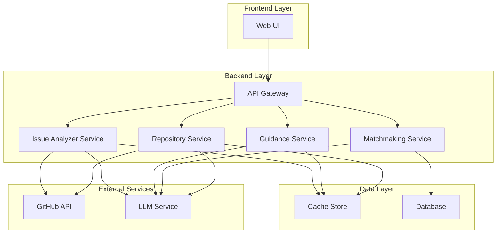

# Onramp - Design Document

## Overview

Onramp is an AI-powered onboarding assistant that helps developers understand unfamiliar codebases and find contribution opportunities. The system analyzes GitHub repositories, matches projects to user profiles, and generates personalized contribution guidance.

The architecture follows a modular, service-oriented design with clear separation between:
- **Frontend**: Web-based user interface
- **Backend API**: RESTful service layer coordinating business logic
- **Analysis Services**: Repository analysis, project matching, and issue classification
- **External Integrations**: GitHub API and LLM services

This design prioritizes modularity, testability, and scalability while maintaining simplicity for MVP delivery.

## Architecture

### High-Level Architecture



### Component Responsibilities

**Frontend (Web UI)**
- User authentication and profile management
- Repository URL input and validation
- Display of analysis results and recommendations
- Interactive contribution path visualization
- Issue browsing with difficulty filters

**API Gateway**
- Request routing and validation
- Rate limiting and authentication
- Response formatting and error handling
- CORS configuration

**Repository Service**
- GitHub repository data fetching
- Repository metadata extraction
- File structure analysis
- Architecture summary generation via LLM
- Module and folder explanation generation
- Caching of analysis results

**Matchmaking Service**
- User profile storage and retrieval
- Repository recommendation algorithm
- Relevance scoring based on user preferences
- Ranking and filtering of recommendations

**Guidance Service**
- Onboarding path generation
- File exploration sequence creation
- Contribution opportunity identification
- Context generation for learning paths

**Issue Analyzer Service**
- Issue fetching from GitHub
- Complexity analysis using LLM
- Difficulty classification (beginner/intermediate/advanced)
- Classification reasoning generation

### Data Flow

**Repository Analysis Flow**:
1. User submits repository URL via UI
2. API Gateway validates and routes to Repository Service
3. Repository Service checks cache for existing analysis
4. If not cached, fetches data from GitHub API
5. Sends repository structure and README to LLM for analysis
6. LLM generates summary, architecture overview, and module explanations
7. Results cached and returned to user

**Project Matchmaking Flow**:
1. User creates/updates profile with skills and interests
2. Profile stored in database
3. User requests recommendations
4. Matchmaking Service retrieves user profile
5. Queries database for analyzed repositories
6. LLM scores repositories against user profile
7. Returns ranked list with reasoning

**Contribution Guidance Flow**:
1. User selects repository for contribution guidance
2. Guidance Service retrieves repository analysis from cache
3. Combines repository data with user profile
4. LLM generates personalized onboarding path
5. Returns structured learning sequence with file recommendations

**Issue Analysis Flow**:
1. User requests issues for a repository
2. Issue Analyzer fetches issues from GitHub API
3. For each issue, analyzes complexity signals (labels, description, comments)
4. LLM classifies difficulty level with reasoning
5. Returns categorized issues to user

## Components and Interfaces

### Frontend Components

**RepositoryInputForm**
- Purpose: Capture and validate repository URLs
- Props: `onSubmit: (url: string) => void`
- State: `url: string, isValid: boolean, error: string | null`

**RepositoryAnalysisView**
- Purpose: Display repository analysis results
- Props: `analysis: RepositoryAnalysis`
- Sections: Summary, Architecture, Modules, Entry Points

**UserProfileForm**
- Purpose: Collect user skills and preferences
- Props: `onSubmit: (profile: UserProfile) => void, initialProfile?: UserProfile`
- Fields: Languages, frameworks, experience level, interests

**ProjectRecommendationsList**
- Purpose: Display recommended repositories
- Props: `recommendations: ProjectRecommendation[], onSelect: (repo: string) => void`
- Features: Filtering, sorting, reasoning display

**ContributionPathView**
- Purpose: Show personalized contribution guidance
- Props: `path: ContributionPath`
- Features: Step-by-step navigation, file links, context explanations

**IssueExplorer**
- Purpose: Browse and filter issues by difficulty
- Props: `issues: ClassifiedIssue[], onFilter: (difficulty: Difficulty) => void`
- Features: Difficulty badges, reasoning tooltips, GitHub links

### Backend API Endpoints

**POST /api/repositories/analyze**
- Request: `{ url: string }`
- Response: `RepositoryAnalysis`
- Description: Analyzes a GitHub repository and returns comprehensive overview

**GET /api/repositories/:owner/:repo**
- Response: `RepositoryAnalysis`
- Description: Retrieves cached repository analysis

**POST /api/users/profile**
- Request: `UserProfile`
- Response: `{ id: string, profile: UserProfile }`
- Description: Creates or updates user profile

**GET /api/users/:userId/profile**
- Response: `UserProfile`
- Description: Retrieves user profile

**POST /api/recommendations**
- Request: `{ userId: string, limit?: number }`
- Response: `ProjectRecommendation[]`
- Description: Generates project recommendations for user

**POST /api/guidance**
- Request: `{ userId: string, repositoryUrl: string }`
- Response: `ContributionPath`
- Description: Generates personalized contribution guidance

**GET /api/issues/:owner/:repo**
- Query Params: `difficulty?: 'beginner' | 'intermediate' | 'advanced'`
- Response: `ClassifiedIssue[]`
- Description: Fetches and classifies repository issues

**GET /api/health**
- Response: `{ status: 'healthy' | 'degraded', services: ServiceStatus[] }`
- Description: Health check endpoint

### Service Interfaces

**IRepositoryService**
```typescript
interface IRepositoryService {
  analyzeRepository(url: string): Promise<RepositoryAnalysis>
  getRepositoryMetadata(owner: string, repo: string): Promise<RepositoryMetadata>
  getCachedAnalysis(owner: string, repo: string): Promise<RepositoryAnalysis | null>
  cacheAnalysis(owner: string, repo: string, analysis: RepositoryAnalysis): Promise<void>
}
```

**IMatchmakingService**
```typescript
interface IMatchmakingService {
  generateRecommendations(userId: string, limit: number): Promise<ProjectRecommendation[]>
  scoreRepository(profile: UserProfile, repository: RepositoryAnalysis): Promise<number>
  saveUserProfile(userId: string, profile: UserProfile): Promise<void>
  getUserProfile(userId: string): Promise<UserProfile | null>
}
```

**IGuidanceService**
```typescript
interface IGuidanceService {
  generateContributionPath(userId: string, repositoryUrl: string): Promise<ContributionPath>
  identifyEntryPoints(repository: RepositoryAnalysis, userLevel: ExperienceLevel): Promise<string[]>
}
```

**IIssueAnalyzerService**
```typescript
interface IIssueAnalyzerService {
  fetchAndClassifyIssues(owner: string, repo: string): Promise<ClassifiedIssue[]>
  classifyIssue(issue: GitHubIssue, repositoryContext: RepositoryAnalysis): Promise<IssueDifficulty>
  filterIssuesByDifficulty(issues: ClassifiedIssue[], difficulty: Difficulty): ClassifiedIssue[]
}
```

**IGitHubClient**
```typescript
interface IGitHubClient {
  getRepository(owner: string, repo: string): Promise<GitHubRepository>
  getFileStructure(owner: string, repo: string): Promise<FileNode[]>
  getReadme(owner: string, repo: string): Promise<string>
  getIssues(owner: string, repo: string, state: 'open' | 'closed' | 'all'): Promise<GitHubIssue[]>
}
```

**ILLMClient**
```typescript
interface ILLMClient {
  generateRepositorySummary(readme: string, structure: FileNode[]): Promise<string>
  generateArchitectureOverview(structure: FileNode[], readme: string): Promise<string>
  explainModules(structure: FileNode[], readme: string): Promise<ModuleExplanation[]>
  scoreRepositoryMatch(profile: UserProfile, repository: RepositoryAnalysis): Promise<MatchScore>
  generateContributionPath(profile: UserProfile, repository: RepositoryAnalysis): Promise<ContributionPath>
  classifyIssueDifficulty(issue: GitHubIssue, repositoryContext: RepositoryAnalysis): Promise<IssueDifficulty>
}
```

**ICacheStore**
```typescript
interface ICacheStore {
  get<T>(key: string): Promise<T | null>
  set<T>(key: string, value: T, ttl?: number): Promise<void>
  delete(key: string): Promise<void>
  has(key: string): Promise<boolean>
}
```

## Data Models

### Core Domain Models

**RepositoryAnalysis**
```typescript
interface RepositoryAnalysis {
  owner: string
  name: string
  url: string
  summary: string
  architecture: ArchitectureOverview
  modules: ModuleExplanation[]
  entryPoints: EntryPoint[]
  metadata: RepositoryMetadata
  analyzedAt: Date
}
```

**ArchitectureOverview**
```typescript
interface ArchitectureOverview {
  description: string
  patterns: string[]  // e.g., "MVC", "Microservices", "Layered"
  technologies: string[]
  keyComponents: string[]
}
```

**ModuleExplanation**
```typescript
interface ModuleExplanation {
  path: string
  name: string
  purpose: string
  keyFiles: string[]
  complexity: 'low' | 'medium' | 'high'
}
```

**EntryPoint**
```typescript
interface EntryPoint {
  file: string
  reason: string
  difficulty: 'beginner' | 'intermediate' | 'advanced'
}
```

**RepositoryMetadata**
```typescript
interface RepositoryMetadata {
  stars: number
  forks: number
  openIssues: number
  language: string
  languages: Record<string, number>  // language -> bytes
  topics: string[]
  lastUpdated: Date
  license: string | null
}
```

**UserProfile**
```typescript
interface UserProfile {
  userId: string
  languages: string[]  // e.g., ["JavaScript", "Python"]
  frameworks: string[]  // e.g., ["React", "Django"]
  experienceLevel: 'beginner' | 'intermediate' | 'advanced'
  interests: string[]  // e.g., ["web development", "machine learning"]
  createdAt: Date
  updatedAt: Date
}
```

**ProjectRecommendation**
```typescript
interface ProjectRecommendation {
  repository: RepositoryAnalysis
  score: number  // 0-100
  reasoning: string
  matchedSkills: string[]
  matchedInterests: string[]
}
```

**ContributionPath**
```typescript
interface ContributionPath {
  repositoryUrl: string
  steps: ContributionStep[]
  estimatedTime: string  // e.g., "2-3 hours"
  difficulty: 'beginner' | 'intermediate' | 'advanced'
}
```

**ContributionStep**
```typescript
interface ContributionStep {
  order: number
  title: string
  description: string
  files: string[]
  concepts: string[]
  resources: Resource[]
}
```

**Resource**
```typescript
interface Resource {
  title: string
  url: string
  type: 'documentation' | 'tutorial' | 'example'
}
```

**ClassifiedIssue**
```typescript
interface ClassifiedIssue {
  issue: GitHubIssue
  difficulty: IssueDifficulty
}
```

**GitHubIssue**
```typescript
interface GitHubIssue {
  id: number
  number: number
  title: string
  body: string
  state: 'open' | 'closed'
  labels: string[]
  createdAt: Date
  updatedAt: Date
  comments: number
  url: string
}
```

**IssueDifficulty**
```typescript
interface IssueDifficulty {
  level: 'beginner' | 'intermediate' | 'advanced'
  reasoning: string
  signals: ComplexitySignal[]
}
```

**ComplexitySignal**
```typescript
interface ComplexitySignal {
  type: 'label' | 'description' | 'scope' | 'dependencies'
  value: string
  impact: 'increases' | 'decreases'  // impact on difficulty
}
```

**FileNode**
```typescript
interface FileNode {
  path: string
  name: string
  type: 'file' | 'directory'
  children?: FileNode[]
  size?: number
  extension?: string
}
```

**MatchScore**
```typescript
interface MatchScore {
  score: number  // 0-100
  reasoning: string
  languageMatch: number  // 0-100
  frameworkMatch: number  // 0-100
  interestMatch: number  // 0-100
  experienceMatch: number  // 0-100
}
```

### Error Models

**APIError**
```typescript
interface APIError {
  code: string
  message: string
  details?: Record<string, any>
  timestamp: Date
}
```

**ErrorCode Enumeration**
- `INVALID_REPOSITORY_URL`: Malformed or inaccessible repository URL
- `REPOSITORY_NOT_FOUND`: Repository does not exist on GitHub
- `RATE_LIMIT_EXCEEDED`: GitHub API rate limit reached
- `LLM_SERVICE_UNAVAILABLE`: LLM service is down or unresponsive
- `ANALYSIS_TIMEOUT`: Repository analysis exceeded time limit
- `INVALID_USER_PROFILE`: User profile data validation failed
- `CACHE_ERROR`: Cache operation failed
- `DATABASE_ERROR`: Database operation failed

## Technology Stack

### Frontend
- **Framework**: React 18 with TypeScript
- **Styling**: Tailwind CSS for responsive design with custom animations
- **UI/UX Enhancements**: 
  - Animated cursor effects for interactive elements
  - Smooth transitions and micro-interactions
  - Clean, minimal design aesthetic
  - Custom Tailwind animations for loading states and transitions
- **State Management**: React Context API (sufficient for MVP)
- **HTTP Client**: Axios for API communication
- **Routing**: React Router v6
- **Form Handling**: React Hook Form with Zod validation
- **Animation Library**: Framer Motion for advanced animations (optional)

**Rationale**: React provides component reusability and strong ecosystem. TypeScript ensures type safety. Tailwind enables rapid UI development with utility-first approach and custom animations. Animated cursor effects and smooth transitions enhance user experience. Clean UI design reduces cognitive load and improves usability. These choices balance developer productivity with maintainability and user delight.

### Backend
- **Runtime**: Node.js 20 LTS
- **Framework**: Express.js
- **Language**: TypeScript
- **Validation**: Zod for request/response validation
- **HTTP Client**: Axios for external API calls

**Rationale**: Node.js enables JavaScript/TypeScript across the stack. Express is lightweight and well-documented. TypeScript prevents runtime errors and improves code quality.

### Data Storage
- **Cache**: Redis for analysis results and temporary data
- **Database**: PostgreSQL for user profiles and persistent data
- **ORM**: Prisma for type-safe database access

**Rationale**: Redis provides fast caching for expensive LLM operations. PostgreSQL offers reliability and ACID compliance. Prisma generates type-safe clients and handles migrations.

### External Services
- **GitHub Integration**: Octokit (official GitHub API client)
- **LLM Service**: OpenAI GPT-4 or Anthropic Claude
- **Rate Limiting**: Express Rate Limit middleware

**Rationale**: Octokit simplifies GitHub API integration with built-in authentication and pagination. GPT-4/Claude provide high-quality analysis. Rate limiting prevents abuse.

### Development & Deployment
- **Package Manager**: npm
- **Testing**: Vitest for unit tests, fast-check for property-based tests
- **Linting**: ESLint with TypeScript rules
- **Formatting**: Prettier
- **Environment**: Docker for containerization
- **Deployment**: Vercel (frontend), Railway/Render (backend)

**Rationale**: Vitest is fast and has excellent TypeScript support. fast-check enables property-based testing. Docker ensures consistent environments. Vercel and Railway offer simple deployment for MVP.

### API Design Patterns
- RESTful endpoints with consistent naming
- JSON request/response format
- HTTP status codes following RFC standards
- Pagination for list endpoints (limit/offset)
- API versioning via URL path (/api/v1/...)

## UI/UX Design Principles

### Clean UI Design

The Onramp interface follows a clean, minimal design philosophy:

**Visual Hierarchy**
- Clear typography with consistent font sizes and weights
- Ample whitespace to reduce visual clutter
- Focused content areas with subtle borders or shadows
- Limited color palette with purposeful accent colors

**Layout Principles**
- Single-column layouts for primary content
- Card-based design for repository analysis and recommendations
- Sticky navigation for easy access to key features
- Responsive grid system using Tailwind's breakpoints

**Color Scheme**
- Light mode with soft backgrounds (gray-50, gray-100)
- Dark mode support with proper contrast ratios
- Accent colors for CTAs and important information
- Semantic colors for success, warning, and error states

### Animated Cursor Effects

**Interactive Elements**
- Custom cursor styles for different interaction zones
- Hover effects that follow cursor movement
- Smooth cursor transitions between states
- Magnetic cursor effect for primary buttons

**Implementation Approach**
```typescript
// Custom cursor component with Tailwind
const CustomCursor = () => {
  return (
    <>
      <div className="cursor-dot" />
      <div className="cursor-outline" />
    </>
  );
};

// Tailwind config for cursor animations
module.exports = {
  theme: {
    extend: {
      animation: {
        'cursor-pulse': 'pulse 2s cubic-bezier(0.4, 0, 0.6, 1) infinite',
        'cursor-scale': 'scale 0.3s ease-in-out',
      }
    }
  }
};
```

**Cursor States**
- Default: Subtle dot with outline
- Hover (links/buttons): Expands with color change
- Active (clicking): Shrinks with feedback
- Loading: Animated spinner cursor
- Text selection: Beam cursor with smooth transition

### Tailwind CSS Animations

**Loading States**
```css
/* Repository analysis loading */
@keyframes shimmer {
  0% { background-position: -1000px 0; }
  100% { background-position: 1000px 0; }
}

.animate-shimmer {
  animation: shimmer 2s infinite linear;
  background: linear-gradient(to right, #f6f7f8 0%, #edeef1 20%, #f6f7f8 40%, #f6f7f8 100%);
  background-size: 1000px 100%;
}
```

**Micro-interactions**
- Button hover: Scale and shadow transition
- Card hover: Lift effect with shadow
- Input focus: Border color transition with glow
- List items: Slide-in animation on load
- Notifications: Slide-in from top with fade

**Transition Classes**
```typescript
// Smooth transitions for all interactive elements
const buttonClasses = `
  transition-all duration-300 ease-in-out
  hover:scale-105 hover:shadow-lg
  active:scale-95
  focus:ring-2 focus:ring-offset-2
`;

const cardClasses = `
  transition-transform duration-200
  hover:-translate-y-1 hover:shadow-xl
`;

const inputClasses = `
  transition-all duration-200
  focus:ring-2 focus:ring-blue-500 focus:border-transparent
`;
```

**Page Transitions**
- Route changes: Fade in/out with slide
- Modal open/close: Scale and fade
- Dropdown menus: Slide down with fade
- Toast notifications: Slide in from edge

### Component-Specific Animations

**RepositoryInputForm**
- Input field expands on focus
- Submit button pulses when ready
- Loading spinner during analysis
- Success checkmark animation on completion

**RepositoryAnalysisView**
- Sections fade in sequentially (stagger effect)
- Code snippets slide in from left
- Architecture diagram animates on scroll
- Expandable sections with smooth height transition

**ProjectRecommendationsList**
- Cards fade in with stagger (50ms delay each)
- Hover reveals additional details with slide
- Filter changes trigger smooth re-layout
- Score meters animate from 0 to value

**ContributionPathView**
- Step-by-step reveal with timeline animation
- Progress indicator animates as user scrolls
- File links highlight on hover with underline animation
- Completion checkmarks animate when steps are done

**IssueExplorer**
- Difficulty badges pulse on hover
- Filter buttons have active state animation
- Issue cards expand on click with smooth height transition
- Sorting triggers smooth reorder animation

### Accessibility Considerations

**Reduced Motion**
- Respect `prefers-reduced-motion` media query
- Provide option to disable animations
- Ensure core functionality works without animations
- Use instant transitions when motion is reduced

```css
@media (prefers-reduced-motion: reduce) {
  * {
    animation-duration: 0.01ms !important;
    animation-iteration-count: 1 !important;
    transition-duration: 0.01ms !important;
  }
}
```

**Keyboard Navigation**
- Visible focus indicators with smooth transitions
- Skip links with slide-in animation
- Focus trap in modals with fade background
- Keyboard shortcuts with visual feedback

### Performance Optimization

**Animation Performance**
- Use CSS transforms (translate, scale) instead of position changes
- Leverage GPU acceleration with `will-change` property
- Debounce cursor tracking to 60fps
- Lazy load animations for below-the-fold content
- Use `requestAnimationFrame` for JavaScript animations

**Tailwind Optimization**
- Purge unused styles in production
- Use JIT mode for faster builds
- Extract common animation classes
- Minimize custom CSS in favor of Tailwind utilities

## LLM Prompt Engineering

### Repository Summary Prompt Template
```
Analyze this GitHub repository and provide a concise summary.

Repository: {owner}/{repo}
README Content:
{readme}

File Structure (top-level):
{structure}

Provide:
1. A 2-3 sentence summary of what this project does
2. The primary programming language and frameworks used
3. The target audience or use case

Keep the explanation clear and accessible to developers unfamiliar with the project.
```

### Architecture Overview Prompt Template
```
Based on this repository structure and README, explain the architecture.

Repository: {owner}/{repo}
File Structure:
{structure}

README:
{readme}

Provide:
1. The architectural pattern used (e.g., MVC, microservices, layered)
2. Key components and their relationships
3. Data flow through the system
4. Technology stack and why it matters

Explain in a way that helps a new contributor understand how the pieces fit together.
```

### Module Explanation Prompt Template
```
Explain the purpose and contents of these directories/modules.

Repository: {owner}/{repo}
Modules to explain:
{modules}

For each module, provide:
1. Its purpose in the overall system
2. Key files and what they do
3. Complexity level (low/medium/high)
4. How it relates to other modules

Target audience: developers new to this codebase.
```

### Project Matching Prompt Template
```
Score how well this repository matches the user's profile.

User Profile:
- Languages: {languages}
- Frameworks: {frameworks}
- Experience Level: {experienceLevel}
- Interests: {interests}

Repository:
- Name: {repoName}
- Languages: {repoLanguages}
- Topics: {topics}
- Description: {description}

Provide:
1. Overall match score (0-100)
2. Reasoning for the score
3. Specific skills that match
4. Specific interests that align
5. Whether the complexity matches their experience level

Be honest about mismatches while highlighting opportunities to learn.
```

### Contribution Path Prompt Template
```
Create a personalized onboarding path for this developer.

User Profile:
- Experience Level: {experienceLevel}
- Languages: {languages}
- Frameworks: {frameworks}

Repository Analysis:
{repositoryAnalysis}

Generate a step-by-step learning path with:
1. 4-6 steps in logical order
2. For each step:
   - Clear title and description
   - Specific files to explore
   - Key concepts to understand
   - Estimated time
3. Suggested first contribution opportunities

Tailor the complexity to their experience level. Make it actionable and encouraging.
```

### Issue Classification Prompt Template
```
Classify the difficulty of this GitHub issue.

Issue:
Title: {title}
Description: {body}
Labels: {labels}
Comments: {commentCount}

Repository Context:
{repositoryContext}

Classify as:
- beginner: Simple fixes, documentation, minor enhancements
- intermediate: Feature additions, refactoring, moderate complexity
- advanced: Architecture changes, complex algorithms, system-wide impacts

Provide:
1. Difficulty level
2. Reasoning for classification
3. Specific complexity signals (labels, scope, dependencies)
4. Skills needed to complete this issue

Be specific about why you chose this classification.
```


## Correctness Properties

*A property is a characteristic or behavior that should hold true across all valid executions of a system—essentially, a formal statement about what the system should do. Properties serve as the bridge between human-readable specifications and machine-verifiable correctness guarantees.*

### Property 1: Repository URL Validation
*For any* string input to the repository analysis endpoint, if it is not a valid GitHub repository URL format, the system should reject it with a descriptut development and evolution.
ntegration) on every pull request
**Nightly**: Run extended property tests with 1000+ iterations
**Release**: Full test suite + manual smoke testing

### Test Data Management

**Fixtures**: Store sample repository data, user profiles, and API responses
**Factories**: Use factory functions to generate test data with sensible defaults
**Cleanup**: Ensure tests clean up database and cache state after execution

This comprehensive testing strategy ensures that Onramp maintains high quality and correctness throughoure).toBeDefined();
    expect(result.body.modules.length).toBeGreaterThan(0);
  });
});
```

### Test Coverage Goals

- **Unit Test Coverage**: Minimum 80% line coverage
- **Property Test Coverage**: All 16 correctness properties implemented
- **Integration Test Coverage**: All API endpoints and critical paths
- **Edge Case Coverage**: All error scenarios documented in Error Handling section

### Continuous Testing

**Pre-commit**: Run unit tests and linting
**CI Pipeline**: Run all tests (unit, property, ipositories)
- Database operations with test database
- Cache operations with test Redis instance

**Example Integration Test**:
```typescript
describe('Repository Analysis Integration', () => {
  it('should analyze a real public repository', async () => {
    const result = await request(app)
      .post('/api/repositories/analyze')
      .send({ url: 'https://github.com/facebook/react' });
    
    expect(result.status).toBe(200);
    expect(result.body.summary).toBeDefined();
    expect(result.body.architectClient: IGitHubClient = {
  getRepository: jest.fn().mockResolvedValue(mockRepositoryData),
  getFileStructure: jest.fn().mockResolvedValue(mockFileStructure),
  getReadme: jest.fn().mockResolvedValue(mockReadmeContent),
  getIssues: jest.fn().mockResolvedValue(mockIssues)
};
```

### Integration Testing

**Scope**: Test interactions between components without mocking internal services

**Focus Areas**:
- API endpoint to service layer integration
- Service layer to external API integration (with real test reg.property.test.ts
│   ├── guidance.property.test.ts
│   └── issue-classification.property.test.ts
├── integration/
│   ├── github-api.integration.test.ts
│   └── llm-service.integration.test.ts
└── fixtures/
    ├── repositories.ts
    └── user-profiles.ts
```

### Mocking Strategy

**External Services**:
- Mock GitHub API responses using fixtures
- Mock LLM service responses with deterministic outputs
- Use dependency injection to swap real clients with mocks

**Example Mock**:
```typescript
const mockGitHubfc.constantFrom('beginner', 'intermediate', 'advanced'),
  interests: fc.array(fc.string(), { minLength: 1, maxLength: 5 })
});
```

### Test Organization

**Directory Structure**:
```
tests/
├── unit/
│   ├── services/
│   │   ├── repository.test.ts
│   │   ├── matchmaking.test.ts
│   │   ├── guidance.test.ts
│   │   └── issue-analyzer.test.ts
│   ├── api/
│   │   └── endpoints.test.ts
│   └── utils/
│       └── validation.test.ts
├── property/
│   ├── repository-analysis.property.test.ts
│   ├── matchmakin, { minLength: 1, maxLength: 39 }),
  fc.stringOf(fc.constantFrom(...'abcdefghijklmnopqrstuvwxyz0123456789-_'), { minLength: 1, maxLength: 100 })
).map(([owner, repo]) => `https://github.com/${owner}/${repo}`);

// Generate random user profiles
const userProfileArbitrary = fc.record({
  userId: fc.uuid(),
  languages: fc.array(fc.constantFrom('JavaScript', 'Python', 'Java', 'Go', 'Rust'), { minLength: 1, maxLength: 5 }),
  frameworks: fc.array(fc.string(), { minLength: 0, maxLength: 5 }),
  experienceLevel: ss properties defined in this document must be implemented as a property-based test. The tests should:

1. Generate random valid inputs using fast-check arbitraries
2. Execute the system operation
3. Assert the property holds for all generated inputs
4. Run minimum 100 iterations per test

**Custom Arbitraries**:
Define custom generators for domain objects:

```typescript
// Generate random valid GitHub URLs
const githubUrlArbitrary = fc.tuple(
  fc.stringOf(fc.constantFrom(...'abcdefghijklmnopqrstuvwxyz0123456789-')nent interactions, API contracts

**Example Unit Test**:
```typescript
describe('Repository Service', () => {
  it('should return 404 error for non-existent repository', async () => {
    const result = await repositoryService.analyzeRepository(
      'https://github.com/nonexistent/repo'
    );
    
    expect(result.error.code).toBe('REPOSITORY_NOT_FOUND');
    expect(result.error.message).toContain('not found');
  });
});
```

### Property-Based Testing Strategy

**Property Test Coverage**:
Each of the 16 correctneidateRepositoryUrl(url);
            expect(result.isValid).toBe(false);
            expect(result.error).toBeDefined();
          }
        }
      ),
      { numRuns: 100 }
    );
  });
});
```

### Unit Testing Strategy

**Focus Areas for Unit Tests**:
1. **Specific Examples**: Test known valid/invalid inputs with expected outputs
2. **Edge Cases**: Empty strings, null values, boundary conditions
3. **Error Conditions**: Specific error scenarios (404, timeout, rate limit)
4. **Integration Points**: Compoeference its design document property
- Tag format: `// Feature: onramp, Property {number}: {property_text}`

**Example Property Test Structure**:
```typescript
import fc from 'fast-check';

// Feature: onramp, Property 1: Repository URL Validation
describe('Repository URL Validation', () => {
  it('should reject invalid GitHub URLs', () => {
    fc.assert(
      fc.property(
        fc.string(), // Generate random strings
        (url) => {
          if (!isValidGitHubUrl(url)) {
            const result = valns
- **Property tests**: Verify universal properties across all inputs using randomized test data

Both approaches are complementary and necessary. Unit tests catch concrete bugs in specific scenarios, while property tests verify general correctness across a wide input space.

### Property-Based Testing Configuration

**Library**: fast-check (JavaScript/TypeScript property-based testing library)

**Configuration**:
- Minimum 100 iterations per property test (due to randomization)
- Each property test must rrepo",
    "operation": "generateSummary"
  }
}
```

**Sensitive Data Handling**
- Never log: API tokens, user passwords, full API responses
- Redact: Email addresses, IP addresses (log hashed versions)
- Sanitize: User input before logging to prevent log injection

## Testing Strategy

### Dual Testing Approach

The Onramp project employs both **unit testing** and **property-based testing** to ensure comprehensive correctness coverage:

- **Unit tests**: Verify specific examples, edge cases, and error conditioe misses, degraded performance
- `INFO`: Request/response logging, analysis completion, user actions
- `DEBUG`: Detailed execution flow, variable values (development only)

**Structured Logging Format**
```json
{
  "level": "ERROR",
  "timestamp": "2024-01-15T10:30:00Z",
  "service": "repository-service",
  "requestId": "req_abc123",
  "userId": "user_xyz789",
  "error": {
    "code": "LLM_SERVICE_UNAVAILABLE",
    "message": "OpenAI API timeout",
    "stack": "..."
  },
  "context": {
    "repository": "owner/ts
- Max retries: 3
- Backoff: Exponential (1s, 2s, 4s)
- Circuit breaker: After 5 consecutive failures, pause for 60s

**LLM API Calls**
- Retry on: 5xx errors, timeouts
- Max retries: 2
- Backoff: Exponential (2s, 4s)
- Timeout: 20 seconds per request

**Database Operations**
- Retry on: Connection errors, deadlocks
- Max retries: 3
- Backoff: Linear (1s, 2s, 3s)

### Logging Strategy

**Log Levels**
- `ERROR`: System errors, external service failures, unexpected exceptions
- `WARN`: Rate limit warnings, cach and value constraints
- Response: 400 with `INVALID_USER_PROFILE` code
- User Message: "Profile validation failed: {specific_field_errors}"

**Cache/Database Errors**
- Detection: Redis or PostgreSQL connection/query failures
- Response: 500 with `CACHE_ERROR` or `DATABASE_ERROR` code
- User Message: "System error occurred. Please try again"
- Logging: Log full error details for debugging
- Fallback: Continue without cache if possible

### Retry Logic

**GitHub API Calls**
- Retry on: 5xx errors, network timeouABLE` code
- User Message: "AI service temporarily unavailable. Please try again later"
- Fallback: Return cached analysis if available, or basic metadata-only response

**Analysis Timeout**
- Detection: Repository analysis exceeds 30-second threshold
- Response: 504 with `ANALYSIS_TIMEOUT` code
- User Message: "Repository analysis is taking longer than expected. Please try again"
- Mitigation: Implement background job processing for large repositories

**Invalid User Profile**
- Validation: Check required fields04
- Response: 404 with `REPOSITORY_NOT_FOUND` code
- User Message: "Repository not found. Please check the URL and try again"

**GitHub Rate Limit Exceeded**
- Detection: GitHub API returns 403 with rate limit headers
- Response: 429 with `RATE_LIMIT_EXCEEDED` code
- User Message: "GitHub API rate limit reached. Please try again in {reset_time}"
- Mitigation: Implement request queuing and caching

**LLM Service Unavailable**
- Detection: LLM API timeout or error response
- Response: 502 with `LLM_SERVICE_UNAVAILot a valid GitHub repository URL",
    "details": {
      "url": "https://example.com/invalid",
      "expected": "https://github.com/{owner}/{repo}"
    },
    "timestamp": "2024-01-15T10:30:00Z"
  }
}
```

### Specific Error Scenarios

**Invalid Repository URL**
- Validation: Check URL format matches `https://github.com/{owner}/{repo}`
- Response: 400 with `INVALID_REPOSITORY_URL` code
- User Message: "Please provide a valid GitHub repository URL"

**Repository Not Found**
- Detection: GitHub API returns 4ta (malformed URLs, invalid profile data)
- `404 Not Found`: Repository or resource does not exist
- `429 Too Many Requests`: Rate limit exceeded

**Server Errors (5xx)**
- `500 Internal Server Error`: Unexpected system errors
- `502 Bad Gateway`: External service (GitHub, LLM) unavailable
- `504 Gateway Timeout`: External service timeout

### Error Response Format

All errors follow a consistent JSON structure:

```json
{
  "error": {
    "code": "INVALID_REPOSITORY_URL",
    "message": "The provided URL is ndates: Requirements 6.6.2**

## Error Handling

### Error Handling Strategy

The system implements a layered error handling approach:

1. **Input Validation Layer**: Validates all inputs at API boundaries using Zod schemas
2. **Service Layer**: Catches and wraps external service errors (GitHub API, LLM)
3. **API Layer**: Transforms errors into consistent HTTP responses
4. **Client Layer**: Displays user-friendly error messages

### Error Categories

**Client Errors (4xx)**
- `400 Bad Request`: Invalid input damade by the system, the total number of calls within a one-hour window should not exceed GitHub's rate limit (5000 for authenticated requests), and when approaching the limit, the system should implement backoff or queuing.

**Validates: Requirements 6.5.3**

### Property 16: Error Logging Completeness
*For any* error that occurs during request processing, an error log entry should be created containing at minimum: timestamp, error code, error message, and request context (endpoint, user ID if available).

**Vali the LLM service, if the LLM service is unavailable or returns an error, the system should return a proper error response (not crash) with error code LLM_SERVICE_UNAVAILABLE and a user-friendly message.

**Validates: Requirements 6.3.3**

### Property 14: API Token Security
*For any* API response or log entry, GitHub API tokens should never appear in plain text in the response body or log message.

**Validates: Requirements 6.5.1**

### Property 15: Rate Limit Compliance
*For any* sequence of GitHub API calls pty reasoning string, and an array of complexity signals.

**Validates: Requirements 5.4.2, 5.4.3, 5.4.4**

### Property 12: Recommendation Filtering Correctness
*For any* set of recommendations and a filter criterion (language, experience level, or interest), all returned recommendations should match the filter criterion, and no matching recommendations from the original set should be excluded.

**Validates: Requirements 5.5.6**

### Property 13: LLM Service Failure Handling
*For any* operation that depends on.

**Validates: Requirements 5.3.3**

### Property 10: Issue Fetching Success
*For any* valid repository with open issues, fetching issues should return a non-empty array of issue objects, each containing required fields: id, number, title, body, state, labels, and url.

**Validates: Requirements 5.4.1**

### Property 11: Issue Classification Completeness
*For any* issue that is classified, the classification result should contain exactly one difficulty level from {beginner, intermediate, advanced}, a non-emray of steps (at least 3 steps), where each step has an order number, title, description, and files array, and the order numbers should form a consecutive sequence starting from 1.

**Validates: Requirements 5.3.1, 5.3.2, 5.3.4, 5.3.5**

### Property 9: Path Difficulty Consistency
*For any* contribution path generated for a user profile, the path's difficulty level should not exceed the user's experience level (beginner paths for beginners, beginner or intermediate for intermediate users, any level for advanced users)commendation includes a score (0-100), non-empty reasoning string, and references to the repository being recommended.

**Validates: Requirements 5.2.2, 5.2.3**

### Property 7: Recommendation Ranking Order
*For any* list of recommendations returned to a user, the recommendations should be ordered by score in descending order (highest score first).

**Validates: Requirements 5.2.4**

### Property 8: Contribution Path Structure Completeness
*For any* generated contribution path, it should contain: a non-empty arequirements 5.1.6**

### Property 5: User Profile Validation
*For any* user profile submission, if it contains invalid data (empty language array, invalid experience level, or missing required fields), the system should reject it with a validation error specifying which fields are invalid.

**Validates: Requirements 5.2.1**

### Property 6: Recommendation Generation with Reasoning
*For any* valid user profile and non-empty repository database, the generated recommendations should be a non-empty array where each re required sections: summary (non-empty string), architecture overview (non-empty string), module explanations (array with at least one entry for non-trivial repos), and entry points (array with at least one entry).

**Validates: Requirements 5.1.3, 5.1.4, 5.1.5, 5.1.6**

### Property 4: Entry Point Difficulty Classification
*For any* repository analysis containing entry points, each entry point should have exactly one difficulty level assigned from the set {beginner, intermediate, advanced}.

**Validates: Rive error and not attempt analysis.

**Validates: Requirements 5.1.1, 6.3.2**

### Property 2: Repository Data Extraction Completeness
*For any* valid GitHub repository, when extraction is performed, the result should contain all required fields: metadata (stars, forks, language), README content, and file structure with at least the root node.

**Validates: Requirements 5.1.2**

### Property 3: Repository Analysis Completeness
*For any* successfully extracted repository data, the generated analysis should contain all